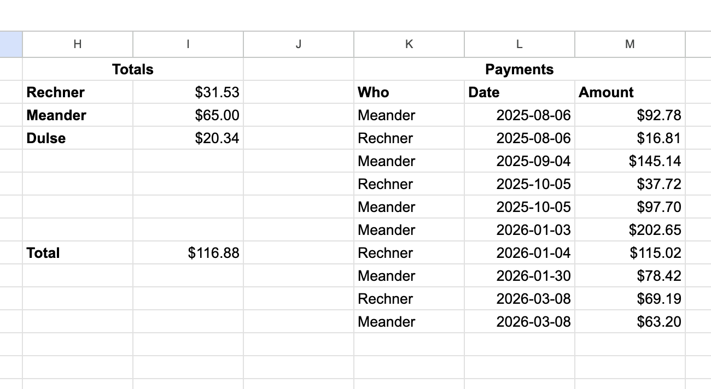

# Cospend Bill Sync Tools

A collection of Python CLI tools that automatically sync utility bills to [Nextcloud Cospend](https://apps.nextcloud.com/apps/cospend) for shared expense tracking.

Theoretically supports any utility supported by [opower](https://github.com/tronikos/opower), but tooled specifically for my particular, quirky use case: PG&E delivered TOU electricity generated by Penninsula Clean Energy ECO100 - YMMV.

There's also another script to do some EV charger accounting from a Google Sheet with data produced by Home Assistant using the Chargepoint and Google sheets integration.

## Tools

### pge-to-cospend

Syncs PG&E (Pacific Gas & Electric) electric and gas bills to Cospend. Authenticates with PG&E via the opower API, fetches the latest billing data, calculates Peninsula Clean Energy generation charges for electric bills, and creates corresponding Cospend bill entries.

By default, when processing the most recent bill, it also creates EV charging bills from the Google Sheet and subtracts the total EV charging cost from the electric bill as a line item. This can be disabled with `EV_CHARGING_ENABLED=false`.

```bash
pge-to-cospend [--dry-run] [--period YYYY-MM-DD]
```

- `--dry-run` — Log what would be created without making changes
- `--period` — Select the bill containing a specific date (for backfilling)

### ev-charger-to-cospend

Syncs EV charger usage from a Google Sheet to Cospend. Reads per-person totals from a ChargePoint Home usage spreadsheet, creates Cospend bills for each person who owes money, and records payments back to the sheet.

```bash
ev-charger-to-cospend [--dry-run]
```

- `--dry-run` — Log what would be created without making changes

## Setup

### Prerequisites

- Python 3.12+
- [uv](https://docs.astral.sh/uv/) package manager

### Installation

```bash
uv sync
```

This installs both tools as CLI commands in the project's virtual environment. Run them with `uv run`:

```bash
uv run pge-to-cospend
uv run ev-charger-to-cospend
```

### Environment Variables

Create a `.env` file (sourced before running) with the following variables:

#### Shared (both tools)

| Variable | Required | Description |
|----------|----------|-------------|
| `NEXTCLOUD_URL` | Yes | Base URL of your Nextcloud instance |
| `COSPEND_PROJECT_ID` | Yes | Cospend project ID (from the project URL) |
| `COSPEND_PROJECT_PASSWORD` | Yes | Cospend project password |
| `COSPEND_PAYER` | Yes | Nextcloud userid of the bill payer |
| `COSPEND_CATEGORY` | No | Category name for bills (e.g., "Bill") |
| `COSPEND_PAYMENT_MODE` | No | Payment mode name (e.g., "Transfer") |

#### PG&E tool only

| Variable | Required | Description |
|----------|----------|-------------|
| `PGE_USERNAME` | Yes | PG&E account email |
| `PGE_PASSWORD` | Yes | PG&E account password |
| `COSPEND_PAYED_FOR` | No | Comma-separated Nextcloud userids to split bills among (blank = all active members) |
| `PGE_LOGIN_DATA_PATH` | No | Path to save PG&E login session data (default: `.pge_login_data.json`) |
| `EV_CHARGING_ENABLED` | No | When `true` (default), the PG&E tool also creates EV charging bills and subtracts the total from the electric bill. Requires `GOOGLE_CREDENTIALS_FILE` and `GOOGLE_SHEET_ID` to be set. Disabled automatically when `--period` is used. |

#### EV charger tool only

| Variable | Required | Description |
|----------|----------|-------------|
| `GOOGLE_CREDENTIALS_FILE` | Yes | Path to Google service account JSON key file |
| `GOOGLE_SHEET_ID` | Yes | Google Sheet ID (from the spreadsheet URL) |

### Google Service Account Setup

The EV charger tool uses a Google service account to access the spreadsheet. Here's how to set one up:

1. **Create a Google Cloud project** (or use an existing one):
   - Go to [Google Cloud Console](https://console.cloud.google.com/)
   - Create a new project or select an existing one

2. **Enable the Google Sheets API**:
   - Navigate to **APIs & Services > Library**
   - Search for "Google Sheets API" and enable it

3. **Create a service account**:
   - Go to **APIs & Services > Credentials**
   - Click **Create Credentials > Service account**
   - Give it a name (e.g., "cospend-sheet-reader")
   - No additional roles needed — click Done

4. **Generate a JSON key**:
   - Click on the newly created service account
   - Go to the **Keys** tab
   - Click **Add Key > Create new key > JSON**
   - Save the downloaded file (e.g., as `service_account.json` in the project root)

5. **Share the spreadsheet with the service account**:
   - Open your Google Sheet
   - Click **Share**
   - Add the service account's email address (looks like `name@project-id.iam.gserviceaccount.com`)
   - Grant **Editor** access (needed to record payments)

6. **Configure the environment variable**:
   ```bash
   export GOOGLE_CREDENTIALS_FILE=service_account.json
   ```

### Google Sheet Structure

The EV charger tool expects a worksheet named "Chargepoint Home" with:

- **Columns H–I** (Totals): Person name in H, amount owed in I (Formula: `=SUMIF($F:$F, H2, $E:$E)-SUMIF($K:$K, H2, $M:$M)`)
- **Columns K–M** (Payments): Who in K, Date in L, Amount in M

The tool reads totals from columns H/I and appends payment records to columns K/M after creating Cospend bills.



### Home Assistant Charger automation

An automation like this populates the Google sheet with our charger data.

- Create a dropdown helper for `which_car_is_charging_at_home`.  The script tries to match lowercase first space delimited field (e.g. first name) with a cospend user.
- Create an automation to add a row when a charger session has ended:

```yaml
alias: Chargepoint Home Accounting
description: ""
triggers:
  - trigger: state
    entity_id:
      - sensor.cph50_charging_status
    to: Available
conditions:
  - condition: template
    value_template: "{{ states('sensor.cph50_max_last_charger_session')|float(0) != 0 }}"
actions:
  - action: google_sheets.append_sheet
    metadata: {}
    data:
      config_entry: 01JDPFE6FM9FP1DSFGX0PN7QSW
      worksheet: ChargePoint Home
      data:
        Date: "{{ now().strftime('%Y-%m-%d %H:%M') }}"
        kWh: "{{ states('sensor.cph50_max_last_charger_session')|float(0) }}"
        Session_Time: " {{ states('sensor.cph50_last_charging_time') }}"
        Charge_Cost: " {{ states('sensor.cph50_last_charge_cost') }}"
        Vehicle: " {{ states('input_select.which_car_is_charging_at_home') }}"
mode: single
```

## How It Works

Both tools use description-based duplicate detection — if a bill with the same description already exists in Cospend, it's skipped. This makes the tools safe to run repeatedly without creating duplicate entries.

### EV Charger Flow

1. Authenticate with Google Sheets via service account
2. Read per-person totals from the spreadsheet
3. Connect to Cospend and fetch existing bills
4. For each person with an outstanding amount:
   - Match their name to a Cospend member (first-word, case-insensitive)
   - Skip if a bill with the same description already exists
   - Create a Cospend bill
   - Record the payment in the spreadsheet

### PG&E Flow

1. Authenticate with PG&E (supports MFA)
2. Fetch the latest electric and gas bills
3. Calculate PCE generation charges for electric bills
4. If EV charging is enabled (default) and this is the most recent bill:
   - Read EV charging totals from the Google Sheet
   - Subtract the total EV charging cost from the electric bill
   - Create individual EV charging bills per person
   - Record payments in the Google Sheet
5. Create Cospend bills for each meter type (skipping duplicates)

## Development

```bash
# Install dev dependencies
uv sync

# Run tests
uv run pytest

# Run a tool in dry-run mode
source .env
uv run ev-charger-to-cospend --dry-run
```
